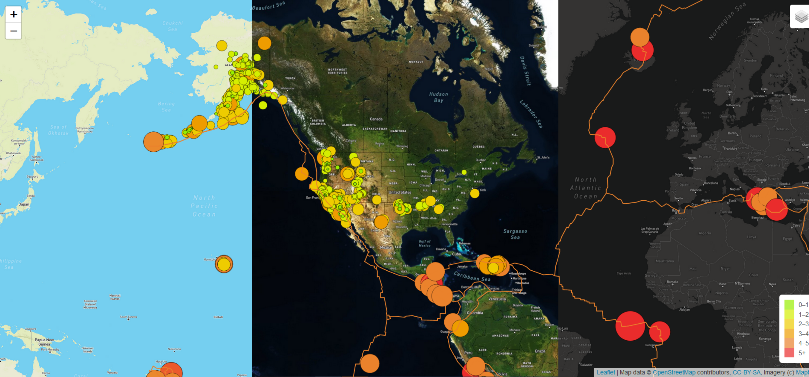

# Mapping Earthquakes

## Overview
We use earthquake data from [USGS](https://earthquake.usgs.gov/earthquakes/feed/v1.0/geojson.php) to create an interactive map using Mapbox API[^mapbox] and LeafletJS[^leaflet].  Our map has overlays displaying tectonic plates[^1], all earthquakes from the past 7 days[^2], and major earthquakes of magnitude 4.5 or higher from the last 7 days[^3], and allows viewers to switch between three different map styles.

## Process

### Parsing GeoJSON Data

The earthquake data is made of GeoJSON Point objects, while the tectonic plate data is GeoJSON LineString objects.  Fortunately, both are easily read with Leaflet's `L.geoJson()` function.  For each of our three overlays, we use D3 to access the data then use the geoJson() function to populate the map.  The tectonic plates are a very simple application, as seen here:  

```javascript
d3.json(platesLink).then(function(data) {
  L.geoJson(data, {
    color: "#ea822c,
    weight: 1.5
  }).addTo(tectPlates);
  tectPlates.addTo(map);
});
```

Earthquake data is a bit more complicated, as we are styling each marker differently and adding a popup to each.  For both earthquake overlays, we follow the format below:

```javascript
d3.json(dataLink).then(function(data) {
  L.geoJson(data, {
    // generate a circle marker at each earthquake location
    pointToLayer: function(feature, latlng) {
      return L.circleMarker(latlng);
    },
    // call styleInfo function to control color and radius of each marker
    style: styleInfo,
    onEachFeature: function(feature, layer) {
      layer.bindPopup("pop-up info");
    }
  }).addTo(overlay);
  overlay.addTo(map);
});
```
    
### Making the Maps

For the map, we use the [Mapbox Streets](https://www.mapbox.com/maps/streets), [Mapbox Satellite Streets](https://docs.mapbox.com/help/getting-started/imagery/), and [Mapbox Dark](https://www.mapbox.com/maps/dark) styles to create three tile layers, and store these in an object named `baseMaps`.  These tile layers all use the same code, simply switching the style variable and the tile layer name as is appropriate: 

```javascript
let darkMap = L.tileLayer('https://api.mapbox.com/styles/v1/mapbox/{mapStyle}/tiles/{z}/{x}/{y}?access_token={accessToken}', {
  attribution: 'Map data &copy; <a href="https://www.openstreetmap.org/">OpenStreetMap</a> contributors, <a href="https://creativecommons.org/licenses/by-sa/2.0/">CC-BY-SA</a>, Imagery (c) <a href="https://www.mapbox.com/">Mapbox</a>',
  maxZoom: 18,
  mapStyle: "dark-v10",
  accessToken: API_KEY
});
```

The overlays are declared simply with `let overlay = new L.LayerGroup();`, with the code described above populating each layer.  These overlays are grouped in an object called `overlays`, similar to the tile layers.  A control panel allowing users to switch between tile layers and toggle overlays is added with `L.control.layers(baseMaps, overlays).addTo(map);`.  This panel currently compresses when not active, though this feature could be disabled.  


[^mapbox]: [Mapbox API documentation](https://docs.mapbox.com/api/overview/)
[^leaflet]: [Leaflet documentation](https://leafletjs.com/)
[^1]: [raw GeoJSON tectonic plates data](https://raw.githubusercontent.com/fraxen/tectonicplates/master/GeoJSON/PB2002_boundaries.json)
[^2]: [raw GeoJSON earthquake data](https://earthquake.usgs.gov/earthquakes/feed/v1.0/summary/all_week.geojson)
[^3]: [raw GeoJSON major earthquake data](https://earthquake.usgs.gov/earthquakes/feed/v1.0/summary/4.5_week.geojson)
